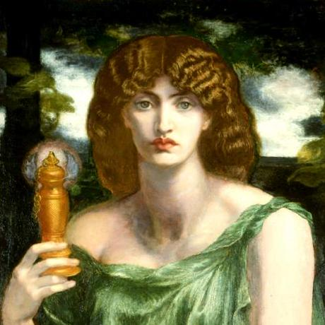

# Content           

## [Introduction](txt/01_intro.md)
## [Memory](txt/02_memory.md)
## [Anki](txt/03_anki.md)
## [Beyond](txt/04_beyond.md)

[source:https://en.wikipedia.org/wiki/Mnemosyne#/media/File:Mnemosyne_(color)_Rossetti.jpg]::

[Quotes](txt/quotes.md)
