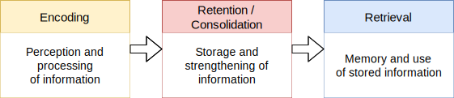

Plato coined the metaphor of the human memory as a wax tablet. It has been an influential metaphor and to this day similar metaphors are common: memory as a library, house or computer storage. Behind them, there are three central assumption: a) memories are stored at a specific location in the brain, b) memories stay in the background passivly until they get retrieved and c) the retrival of memories is a transfer from information in one store (long-term memory) to another (short-term or working memory). As we will see, these three assumptions are problematic and have to be revised. Memory is not a passiv storage of information, it is a dynamic process.

The current paradigm for memory research is the so called information processing paradigm. This paradigm asserts that beings don't react directly to a stimulus, rather their reactions are determined by mental representations of the stimulus within a frame of reference. It is an open research question what these mental representation exactly are. Cognition also is a form of information processing based on mental representations: 
1. Learning is the encoding of new information or the modification of stored information,
2. Memory is the storage of information, and
3. Recall is the retrieval of stored information.

This distinction is essential. The following figure shows this in an exact terminology. The storage of information is also called retention / consilidation. We will refer back to this later. 

*Fig X: The three phases of memory processes.*

The most commmon way to classify the human memory is in term of durability. The popular distinction between short-term and long-term memory was postulated in a paper by Atkinson and Shiffrin (1968). They also describe a third, lesser known memory instance: the sensory register, where sensory information is stored just as long engough to enter the short-term or working memory.

[<< Back](../index.md)
