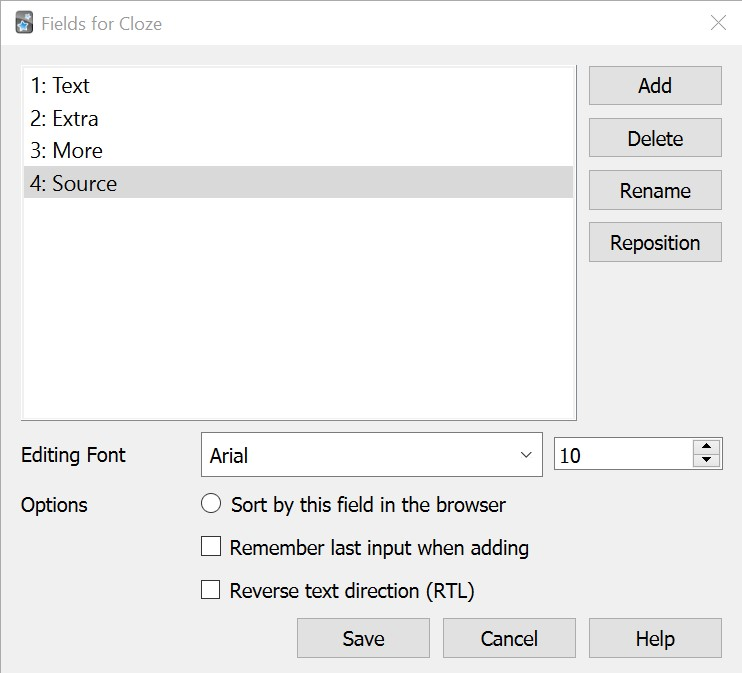

This is a minimalistic card template that is adaptable to many use cases. It is based on text clozes as they can be easily used in a Q&A-style as well. There are 4 fields: Text, Extra, More and Source. The Source-field can only be seen in the card browser and in order to save space the editing font can be set to 10px. 

<center></center>

The following is the code for cards.

Front Template:
``` 

{{cloze:Text}}

``` 

Back Template:
``` 

{{edit:cloze:Text}}
<hr>
{{edit:Extra}}

{{#More}}
<hr>
<a class=more href="#"onclick="this.style.display='none';
document.getElementById('more_back').style.display='inline-block';
return false;"
>Show more</a>
<div id="more_back" class=more style="display: none">{{edit:More}}</div>
{{/More}}

``` 
Comment: This creates a "Show more"-button on the backside of a card. This button only shows up when something is in the More-field. 


Styling:

``` 

.card {
    font-family: arial;
    font-size: 20px;
    text-align: center;
    color: black;
    background-color: #d3d3d3;
}

.nightMode .card {
    color: white;
    background-color: #2F2F31;
}

.cloze {
    font-weight: bold;
    color: blue;
}

.nightMode .cloze, .mobile .night_mode .cloze {
    color: lightblue;
}

body ul, body ol, body dl {
    text-align: left;
    display: inline-block;
    margin-bottom: 0;
}

.more {
    padding: 6px 40px;
    text-align: center;
    text-decoration: none;
    display: inline-block;
    border-radius: 6px;
    background-color: white; 
    color: black;
    border: 1px solid black;
    transition-duration: 0.3s;
}

.more:hover {
    background-color: transparent;
    border: 1px solid transparent;
    color: black;
}

.nightMode .more:hover {
    color: white;
}

#more_back {
    all: initial;
    * { all: unset; }
    margin-top: 7px;
    padding-top: 7px;
    color: inherit;
    font-family: inherit;
    font-size: inherit;
    text-align: center;
}

.mobile .night_mode #more_back {
    color: white;
}

``` 
Comment: Besides styling the "Show more"-button, this also formats lists to be left-justified and to be shown in the center of a card.


[<< Back](../index.md)
