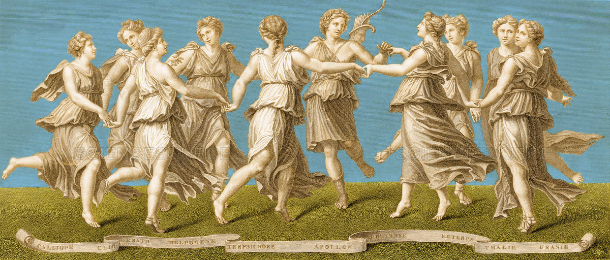

In acient Greek mythology the nine Muses are the inspirational goddesses of literature, science, and the arts. Like most mythological creatures they are embedded in the ancient family tree of gods and titans. The nine Muses share the same father: Zeus; their mother is the daughter of Sky (Uranus) and Earth (Gaia): Mnemosyne. Her name is derived from the Greek word mnēmē, which means remembrance, memory. **Memory is the Mother of Muses.**

http://brandl-art-articles.blogspot.com/2013/12/the-nine-arts-and-nine-muses.html + wiki
    Calliope (epic poetry)
    Clio (history)
    Euterpe (flutes and music)
    Thalia (comedy and pastoral poetry)
    Melpomene (tragedy)
    Terpsichore (dance)
    Erato (love poetry and lyric poetry)
    Polyhymnia (sacred poetry)
    Urania (astronomy)

“Mnemosyne, one must admit, has shown herself to be a very careless girl”, the Russian author Nabokov wrote in his autobiography. Indeed, and if this weren't the case, this blog would not exist. The aim of this blog is to prepare one possible approach for lifelong learning in the digital age. First, we take a look at cognitive and experimental psychology, then we will try to apply what we have learned to the flashcard program Anki. 
This blog is intended for the lifelong learner and for the advanced Anki user, who is looking for new ideas. It is not intended for language learning, exam preperation nor as a means to make learning necessarily easier. However, some of the basics we will cover may be useful for any learner. The main idea behind this "framework" is to make knowledge meaningful and learning/remembering an active experience. As always, there are multiple approaches to everything, you take the approach you want. Have fun. 

Repetition is key. 
